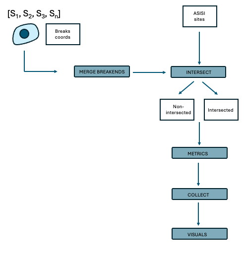

This workflow is designed to identify samples treated with AsiSI enzyme form the Double Strand Break (DSB) signature derived from INDUCE-Seq.
The enzyme localised in the nucleus after treatment with 4OHT and triggers DSB at restriction sites. Not all restriction sites are affected due to chromatin accessibility of the region.
INDUCE-Seq detects every DSB in the genome with no bias, including the enzyme-induced DSBs at AsiSI target sites.
The frequency across one regions represents the propensity of that region to DSB in a certain cell type/condition. This can be quantified against the signal background 



## Inputs
- All restriction sites coordinates (chr21) are contained in [chr21_AsiSI_sites.t2t](./assets/chr21_AsiSI_sites.t2t.bed).
- All DSB coordinated are contained in [breaks](./data/breaks/)

## Logic
- MERGE BREAKENDS

### Bed format
`chr    start   end     ID    MAPQ     strand`
Strand is irrelevant in DSB

Using `bedtools merge` to merge reads that are overlapping or adjacent.  Counts updated

```param = merge_dist``` : default = 0

- INTERSECT
Using `bedtools intersect` to count the overlaps between DSB in each sample and the reference AsiSI coordinates.
This indicates how many DSB occur at the expected restriction sites and will be used as proxy to assess treatment.
It also returns the non-overlapping coordinates

- COUNTS
Various metrics are calculated per sample: DSB rate per Asisi, DSB rate overall.

- COLLATE_METRICS
Stats and metrics collated for all samples 

- VISUALS
Visual functions are added but not used since matplotlib is not installed in Docker. It would require installation


## use
### 1 Activate environment with nextflow and Docker installed
`conda activate my_env`
### 2 Start docker
`open -a Docker`
### 3 Run Nextflow workflow
`nextflow main.nf`
### 4 Run with conda for generating plots
`nextflow main.nf -profile conda`